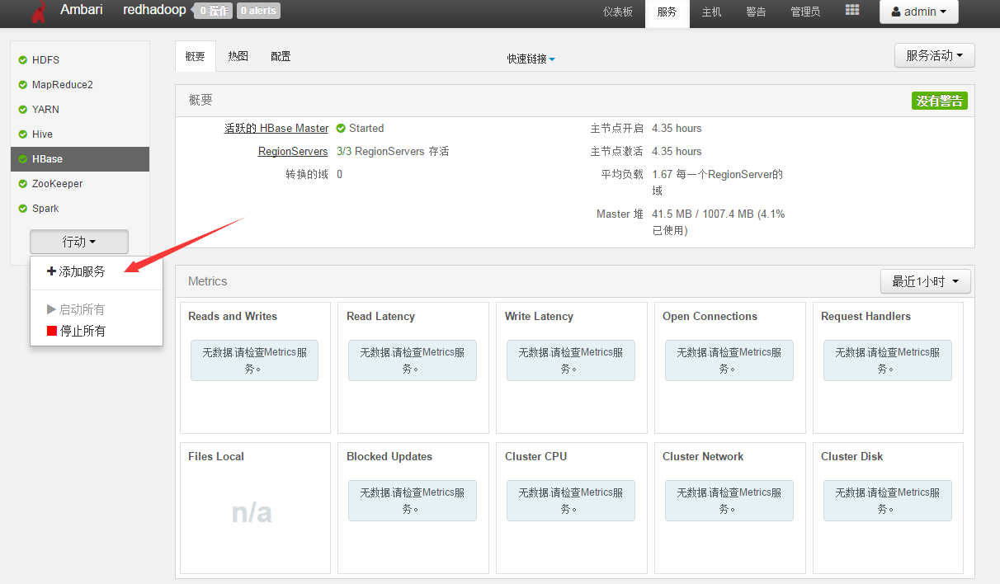
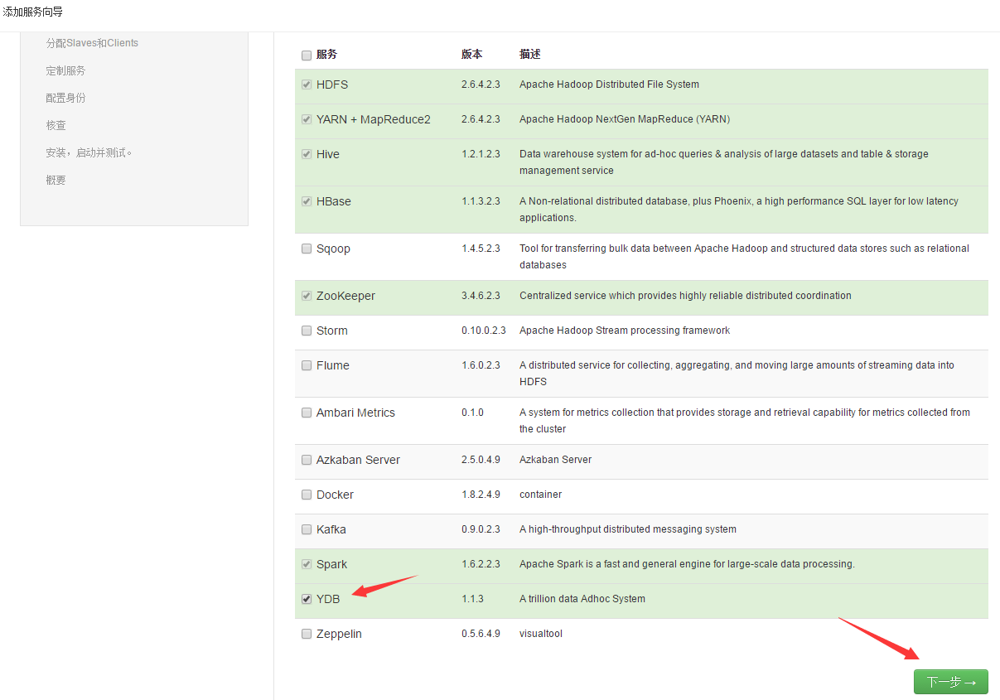
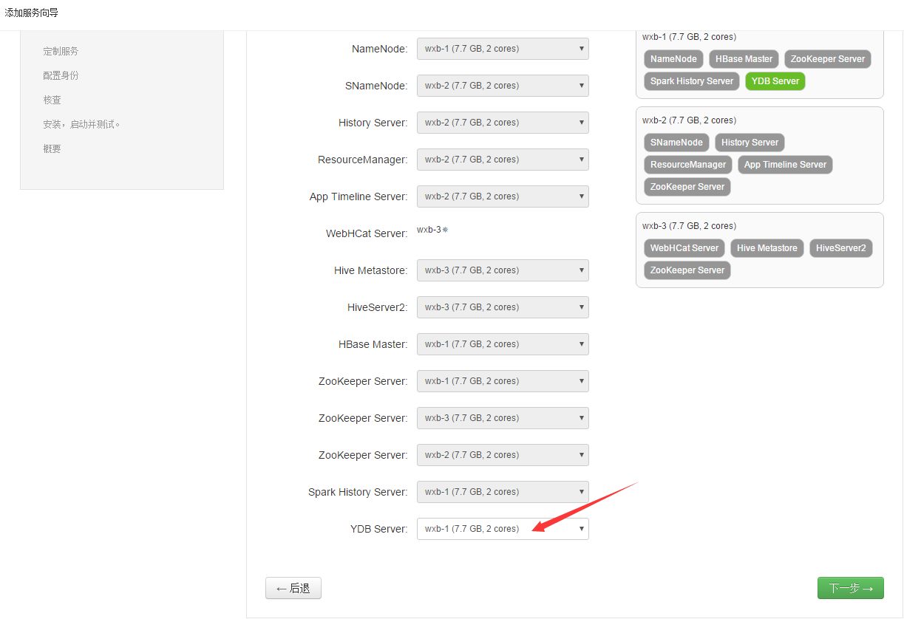
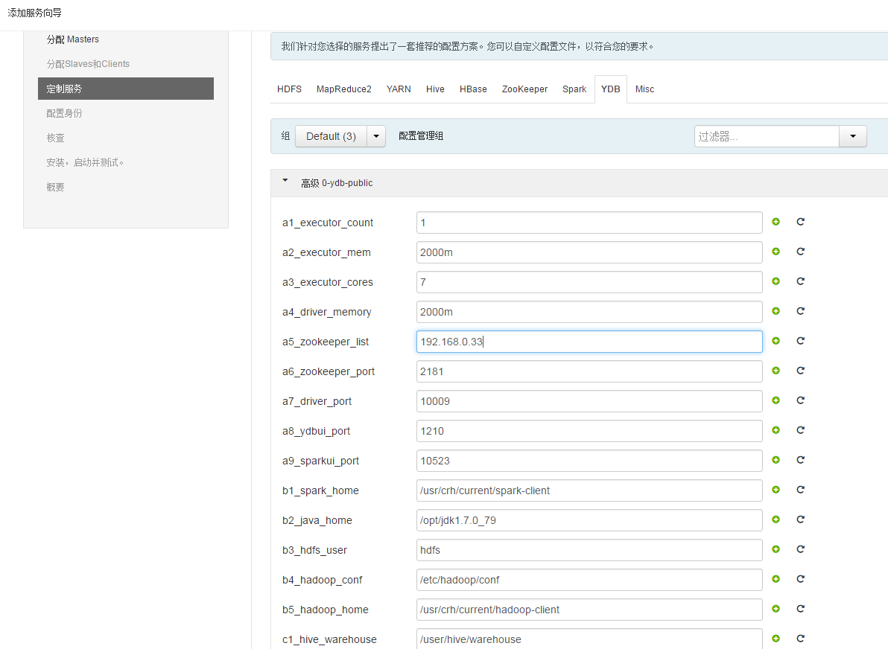
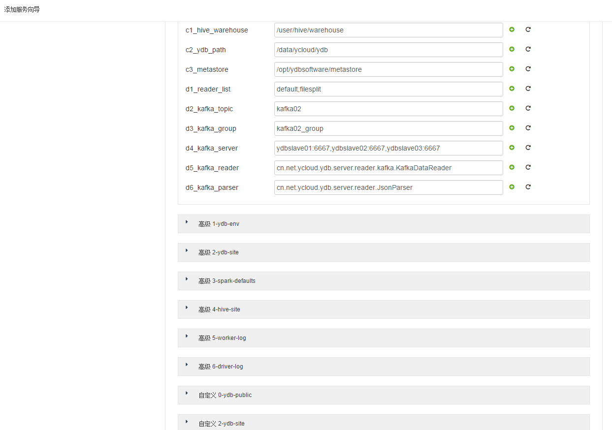
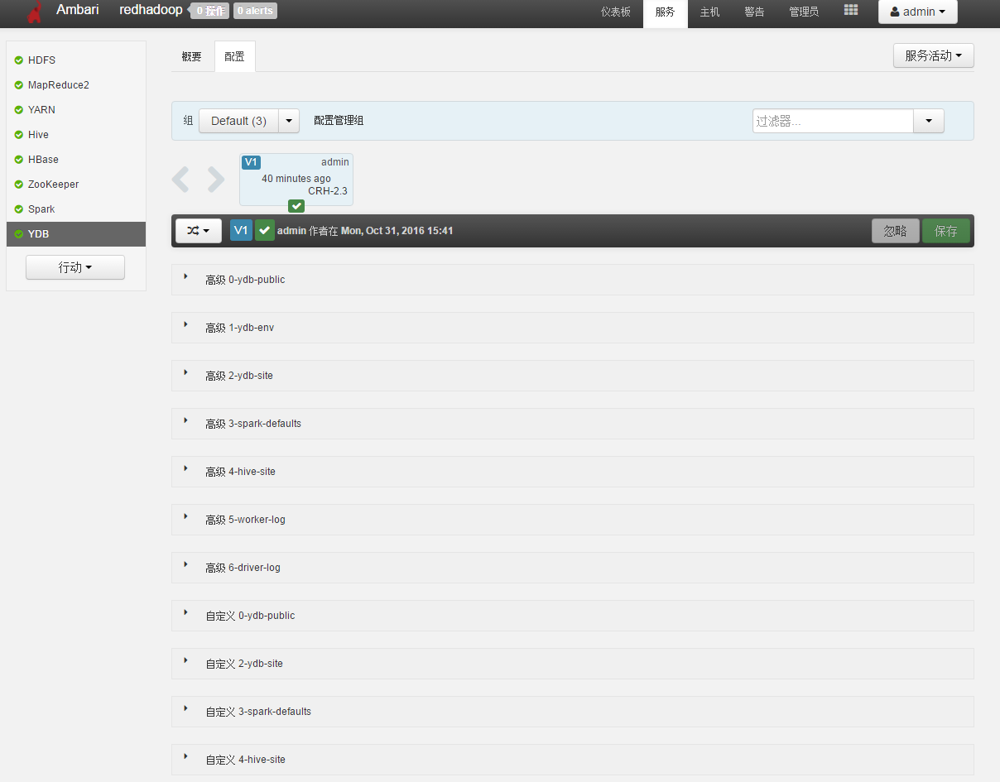
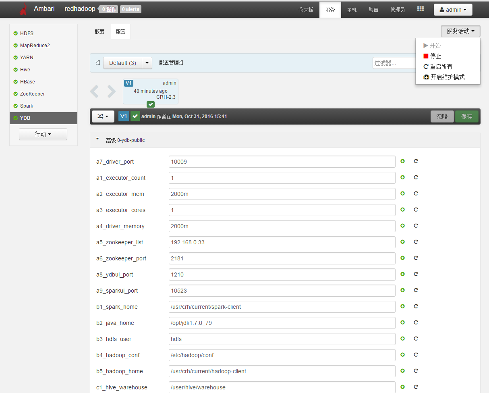

# ambari-ydb-service
## Setup
* 操作系统为centos6.x
* CRH4.9集群
* 必须提前启动spark，zookeeper。
* 下载ydb service，运行下面命令

```
sudo git clone http://www.redhub.io/Redoop-YDB/ambari-ydb-service.git   /var/lib/ambari-server/resources/stacks/CRH/2.3/services/YDB
```

* Restart Ambari

```
ambari-server restart
```

* 登录ambari图形界面（http://localhost:8080）
* 点击添加服务

* 选择服务组件YDB

* 选择要安装的机器

* 修改配置文件

注意zookeeper地址，若有多个则进行逗号分隔，JAVA_HOME，SPARK_HOME和一些资源配置[详细文档](http://www.redhub.io/OpenDoc/www.redoop.com/src/master/Redoop-CRH-YDB)。

注意kafka配置。
* 安装和部署
* 安装成功界面


